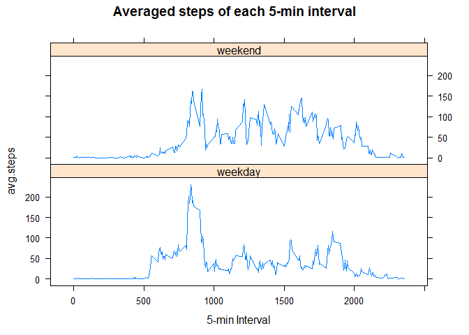

# RepData PeerAssessment1
Angel Sevilla Camins  
2016-06-06  


## Loading and preprocessing the data

1. Load the needed packages and the data   


```r
#install.packages(lubridate)
library(lubridate)
#install.packages("dplyr")
library(dplyr)
#install.packages("tidyr")
library(tidyr)
#install.packages("lattice")
library(lattice)

if(!file.exists("./activity.csv")) unzip("activity.zip",exdir = ".")
Data <- read.table("activity.csv", sep = ",", stringsAsFactors =FALSE,
                   header = TRUE)
```

2. Transform dates into a format suitable for the analysis


```r
Data <- Data %>% mutate(date = as.Date(date), yearday = yday(date))
str(Data)
```

```
## 'data.frame':	17568 obs. of  4 variables:
##  $ steps   : int  NA NA NA NA NA NA NA NA NA NA ...
##  $ date    : Date, format: "2012-10-01" "2012-10-01" ...
##  $ interval: int  0 5 10 15 20 25 30 35 40 45 ...
##  $ yearday : num  275 275 275 275 275 275 275 275 275 275 ...
```
## What is mean total number of steps taken per day?

1. Make a histogram of the total number of steps taken each day


```r
nsteps.day <- Data %>% group_by(yearday) %>% 
                      summarise(sum.steps = sum(steps, na.rm = TRUE))
    
hist(nsteps.day$sum.steps, xlab = "steps taken per day", 
     main = "Histogram of steps taken per day")
```

<!-- -->

2. Calculate and report the **mean** and **median** total number of steps taken per day


```r
nsteps.day  %>% summarise(mean = mean(sum.steps, na.rm = TRUE))
```

```
## Source: local data frame [1 x 1]
## 
##      mean
##     (dbl)
## 1 9354.23
```

```r
nsteps.day  %>% summarise(median = median(sum.steps, na.rm = TRUE))
```

```
## Source: local data frame [1 x 1]
## 
##   median
##    (int)
## 1  10395
```

## What is the average daily activity pattern?

1. Make a time series plot of the 5-minute interval (x-axis) and the average number of steps taken, averaged across all days (y-axis)


```r
nsteps.interval <- Data %>% group_by(interval) %>% 
    summarise(sum.steps = sum(steps, na.rm = TRUE))
    
with(nsteps.interval, plot(interval,sum.steps, type = "l",
                          xlab = "5-min Interval", 
                          main = "Averaged steps of each 5-min interval"))
```

<!-- -->


2. Which 5-minute interval, on average across all the days in the dataset, contains the maximum number of steps?


```r
nsteps.interval %>% filter(sum.steps == max(sum.steps))
```

```
## Source: local data frame [1 x 2]
## 
##   interval sum.steps
##      (int)     (int)
## 1      835     10927
```

## Imputing missing values

1. Calculate and report the total number of missing values in the dataset (i.e. the total number of rows with `NA`s)

```r
Data %>% filter(is.na(steps) == TRUE) %>%  summarise(nNas = n())
```

```
##   nNas
## 1 2304
```
2. Devise a strategy for filling in all of the missing values in the dataset. The strategy does not need to be sophisticated. For example, you could use the mean/median for that day, or the mean for that 5-minute interval, etc.

**The strategy selected was filling in NAs with the mean of the 5-min interval since several days were fully recorded as NAs. For that, the vector of the means of the 5-min interval (steps.mean) is multiplied by a vector fill with 1 if the value is NA or 0 otherwise. Therefore, only NAs values will have a value greater than 0. Then, this vector is added to another vector in which NAs have been replaced by 0 (steps.NONA). This strategy maintains a vectorized form which could be compatible with parallelization**


```r
Data.temp.NoNA <- Data  %>% group_by(interval) %>% 
        mutate(steps.mean = mean(steps, na.rm = TRUE),
               steps.NONA = replace(steps,which(is.na(steps) == TRUE), 0),
               steps.NONA.mean = steps.NONA + 
               as.numeric(is.na(steps))*steps.mean)
```
3. Create a new dataset that is equal to the original dataset but with the missing data filled in.

```r
Data.NoNA <- Data.temp.NoNA %>% select(steps = steps.NONA.mean
                                       ,date ,interval, yearday)
Data.NoNA
```

```
## Source: local data frame [17,568 x 4]
## Groups: interval [288]
## 
##        steps       date interval yearday
##        (dbl)     (date)    (int)   (dbl)
## 1  1.7169811 2012-10-01        0     275
## 2  0.3396226 2012-10-01        5     275
## 3  0.1320755 2012-10-01       10     275
## 4  0.1509434 2012-10-01       15     275
## 5  0.0754717 2012-10-01       20     275
## 6  2.0943396 2012-10-01       25     275
## 7  0.5283019 2012-10-01       30     275
## 8  0.8679245 2012-10-01       35     275
## 9  0.0000000 2012-10-01       40     275
## 10 1.4716981 2012-10-01       45     275
## ..       ...        ...      ...     ...
```
4. Make a histogram of the total number of steps taken each day and Calculate and report the **mean** and **median** total number of steps taken per day. Do these values differ from the estimates from the first part of the assignment? What is the impact of imputing missing data on the estimates of the total daily number of steps?

```r
nsteps.day.NoNA <- Data.NoNA %>% group_by(yearday) %>% 
    summarise(sum.steps = sum(steps))

hist(nsteps.day.NoNA$sum.steps, xlab = "steps taken per day", 
     main = "Histogram of steps taken per day NO NAs")
```

<!-- -->

```r
nsteps.day.NoNA  %>% summarise(mean = mean(sum.steps))
```

```
## Source: local data frame [1 x 1]
## 
##       mean
##      (dbl)
## 1 10766.19
```

```r
nsteps.day.NoNA  %>% summarise(median = median(sum.steps))
```

```
## Source: local data frame [1 x 1]
## 
##     median
##      (dbl)
## 1 10766.19
```
**If NAs are not replaced by the average, they are consider 0, which introduces outliers in most of the cases (i.e. from intervals 500 to 2000). The mean is highly sensitive to these outliers and it tends to decrease when NAs are not replaced by the mean. In contrast, the median is less sensitive to outliers and they are more similar in both cases and identical to the mean when NAs are replaced**

## Are there differences in activity patterns between weekdays and weekends?

1. Create a new factor variable in the dataset with two levels -- "weekday" and "weekend" indicating whether a given date is a weekday or weekend day.

```r
#Set date language to English
Sys.setlocale("LC_TIME", "English")
```

```
## [1] "English_United States.1252"
```

```r
Data.NoNA <- Data.NoNA %>% mutate(Daytype = weekdays(date),
             Weekday = ifelse(Daytype == "Saturday" | Daytype == "Sunday",
                              "weekend","weekday"))
Data.NoNA      
```

```
## Source: local data frame [17,568 x 6]
## Groups: interval [288]
## 
##        steps       date interval yearday Daytype Weekday
##        (dbl)     (date)    (int)   (dbl)   (chr)   (chr)
## 1  1.7169811 2012-10-01        0     275  Monday weekday
## 2  0.3396226 2012-10-01        5     275  Monday weekday
## 3  0.1320755 2012-10-01       10     275  Monday weekday
## 4  0.1509434 2012-10-01       15     275  Monday weekday
## 5  0.0754717 2012-10-01       20     275  Monday weekday
## 6  2.0943396 2012-10-01       25     275  Monday weekday
## 7  0.5283019 2012-10-01       30     275  Monday weekday
## 8  0.8679245 2012-10-01       35     275  Monday weekday
## 9  0.0000000 2012-10-01       40     275  Monday weekday
## 10 1.4716981 2012-10-01       45     275  Monday weekday
## ..       ...        ...      ...     ...     ...     ...
```
2. Make a panel plot containing a time series plot (i.e. `type = "l"`) of the 5-minute interval (x-axis) and the average number of steps taken, averaged across all weekday days or weekend days (y-axis). 

```r
nsteps.weekday.NoNA <- Data.NoNA %>% group_by(interval,Weekday) %>% 
    summarise(sum.steps = sum(steps))

with(nsteps.weekday.NoNA, 
     xyplot(sum.steps ~ interval | Weekday , type = "l",
            layout = c(1, 2), xlab = "5-min Interval", 
            main = "Averaged steps of each 5-min interval"))
```

<!-- -->

**Weekends present fewer steps in average, probably since the owners were resting**
